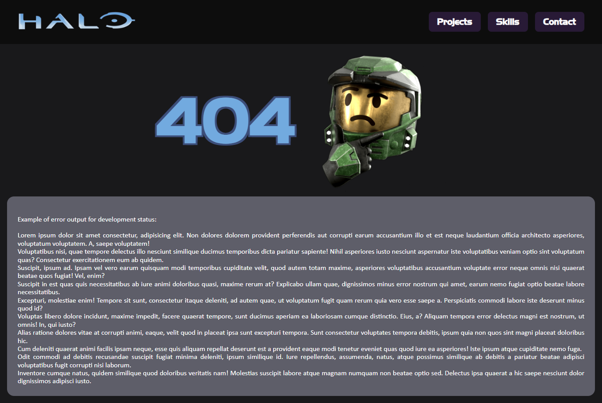

# Selecciona tu lenguaje

- 🇺🇸 [English](README.md)
- 🇩🇪 [Deutsch](README.de.md)

# Entrega Proyecto de CSS y HTML

Este proyecto fue creado con el fin de ejercitar y demostrar los conocimientos adquiridos en clases virtuales sobre HTML y CSS.

## El proyecto abarca los siguientes aspectos clave:

- Implementación de **HTML** estructurado y su interacción con el **DOM**, acompañado de estilos en cascada mediante **CSS**.
- Uso adecuado de la **semántica** de las etiquetas HTML, combinado con reglas CSS que mejoran la accesibilidad y el rendimiento.
- Desarrollo de **media queries** para garantizar un diseño **responsivo** y adaptable a diversas resoluciones de pantalla.
- Creación de **animaciones** y **transiciones** dinámicas utilizando **CSS** para mejorar la experiencia de usuario.
- Personalización de animaciones mediante el uso de **keyframes**, logrando efectos visuales únicos.
- Diseño de un **layout responsivo** mediante el uso de **grids** en CSS para una estructura flexible y escalable.
- Aplicación de una correcta **jerarquía CSS**, asegurando la correcta estilización y coherencia visual de los elementos.
- Análisis del comportamiento de las diferentes **etiquetas HTML** y su interacción con **CSS** para optimizar la presentación del contenido.
- Implementación de **inputs** con **validaciones** eficientes, asegurando la correcta interacción del usuario con los formularios.
- Incorporación de **links** para la navegación a otros sitios web, mejorando la conectividad y accesibilidad.
- Garantía de la **cohesión y limpieza del código**, con una estructura organizada que facilita el mantenimiento y la escalabilidad del proyecto.

## Objetivo del Proyecto
El objetivo principal de este proyecto es desarrollar un **portfolio** personal (o de un personaje de ficción), aplicando los conocimientos adquiridos en clase. La idea es crear una presentación interactiva y visualmente atractiva que muestre las habilidades y proyectos de nuestro personaje elegido, utilizando las tecnologías y prácticas aprendidas durante el curso.

## Detalles del Proyecto

- Se debe de crear un **header**, en el que los enlaces deben tener el estado `hover` suavizado con una transición. Estos links no son necesarios en la versión móvil.
- Una sección con una descripción de **nosotros** y nuestras habilidades representadas mediante **barras de progreso**. Estas barras deben estar animadas utilizando **CSS**.
- Un **banner** que deberá tener una imagen de fondo. En pantallas móviles, debe mostrarse otra imagen diferente (Implementar **media queries** o **Responsive images**).
- Formulario de contacto mediante **inputs**. Todos deben tener tanto los tipos correctos como la validación HTML de cada campo:
   - **Nombre**, **Apellidos**, **Teléfono** (campos requeridos).
   - **Radio input** para responder a la pregunta "¿cómo me conociste?" (campo requerido):
      - Universidad
      - Keepcoding kick-off
      - Colegio
      - En GitHub
   - **Tag de GitHub** (Usar expresión regular `^@[^\s]+` para la validación - `@username`).
   - **Textarea** con más información del usuario (máximo 180 caracteres) (campo requerido).
   - **Checkbox** para el acceso a la **newsletter**.
   - Botones de **guardar** y **reset**.
- **Footer** con enlaces a nuestras redes sociales mediante recursos externos.
- Nueva página que contenga un **video** que se reproduzca automáticamente al entrar en la web y aparezca con una animación de **fadeIn**.
- Crear una nueva página con un **grid** que muestre nuestros proyectos.

## Tecnologías

Este proyecto fue desarrollado utilizando exclusivamente con las siguientes tecnologías:

- **HTML**: Para la estructuración del contenido y la creación de la estructura de la página web.
- **CSS**: Para el diseño y estilo visual de la página, asegurando una experiencia de usuario atractiva y coherente.

## Instrucciones de Instalación y Uso

### Requisitos de Software

- **Git** (Requerido)
- **SourceTree** (Opcional)
- **Visual Studio** (Ejecutado en la versión 1.99.0) (Requerido)
- **Live Server** (Addon de Visual Studio, Opcional)

### Descripción de los Programas

- **Git**: Herramienta de control de versiones. Es imprescindible para clonar el repositorio.
- **SourceTree**: Una herramienta visual para gestionar repositorios Git. Permite interactuar con Git de forma sencilla sin necesidad de utilizar la línea de comandos.
- **Visual Studio**: Entorno de desarrollo integrado (IDE) necesario para ejecutar el proyecto. Asegúrate de utilizar la versión 1.99.0 para evitar problemas de compatibilidad.
- **Live Server**: Extensión de Visual Studio que permite visualizar los archivos HTML de manera local en un navegador, mostrando los cambios en tiempo real.

### Pasos para utilizar este proyecto

1. Clona el repositorio de GitHub utilizando **SourceTree** o directamente con el siguiente comando mediante Git:

   ```bash
   git clone https://github.com/PabloSch26/keepcoding-html-css-submission-2.git

2. Una vez clonado el repositorio:

2.1 Abre el proyecto en Visual Studio agregando el directorio del proyecto a tu espacio de trabajo.

2.2 Abre los archivos index.html, proyect.html, 404.html y 500.html con Live Server para previsualizarlos en el navegador.

### Notas

- Asegúrate de tener correctamente instalados todos los programas necesarios antes de proceder con la ejecución del proyecto.
- Si no deseas usar SourceTree, puedes clonar el repositorio directamente usando la terminal con el comando git clone.

## Sin contribuciones ni licencias

Este proyecto no cuenta con contribuciones externas ni licencia en este momento.

## Vista previa del proyecto

### Index View

### Index Mobile View

### Projects View

### Projects Mobile View

### 404 View

### 404 Mobile View

