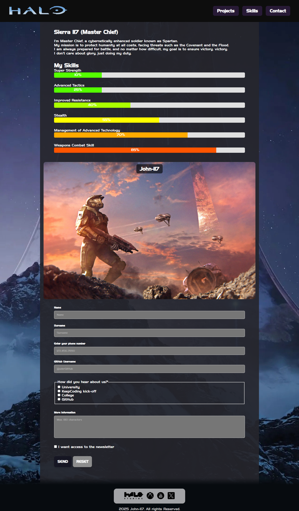
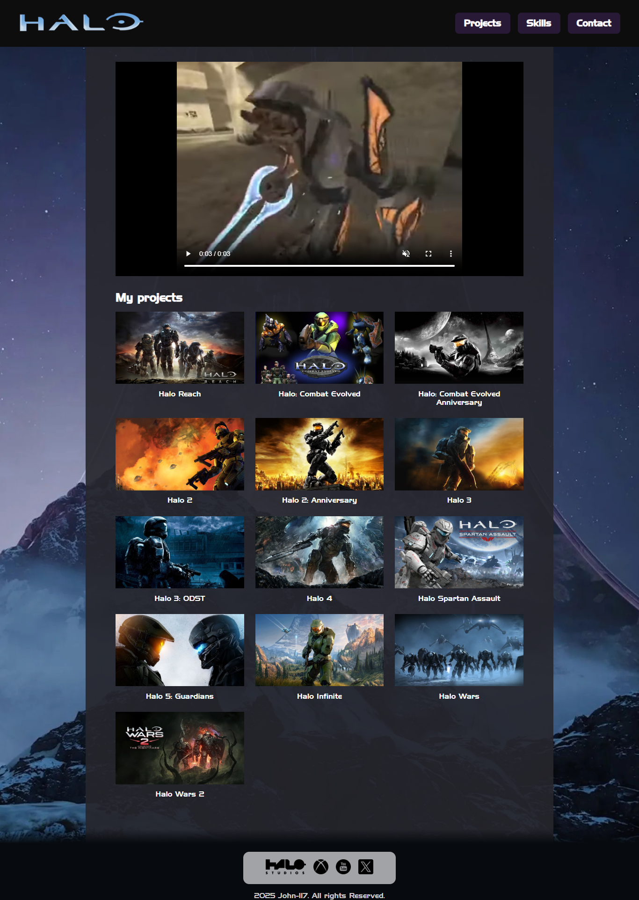
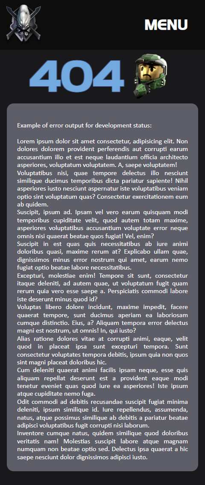

# Entrega Proyecto de CSS y HTML

**Proyectos KeepCoding - Web 18**  
Consulta la lista completa de repositorios y descripciones en [repos-kc-web-18.md](https://github.com/pablo-sch/pablo-sch/blob/main/docs/repos-kc-web-18.md)

## Selecciona tu Idioma

- 🇺🇸 [Inglés](README.md)
- 🇩🇪 [Alemán](README.de.md)

<!-- ------------------------------------------------------------------------------------------- -->
## Objetivo del Proyecto

El objetivo principal de este proyecto es desarrollar un **portfolio** personal (o de un personaje de ficción), aplicando los conocimientos adquiridos en clase. La idea es crear una presentación interactiva y visualmente atractiva que muestre las habilidades y proyectos de nuestro personaje elegido, utilizando las tecnologías y prácticas aprendidas durante el curso.

<!-- ------------------------------------------------------------------------------------------- -->
## Conocimientos Aprendidos y Trabajados

- Implementación de **HTML** estructurado y su interacción con el **DOM**, acompañado de estilos en cascada mediante **CSS**.
- Uso adecuado de la **semántica** de las etiquetas HTML, combinado con reglas CSS que mejoran la accesibilidad y el rendimiento.
- Desarrollo de **media queries** para garantizar un diseño **responsivo** y adaptable a diversas resoluciones de pantalla.
- Creación de **animaciones** y **transiciones** dinámicas utilizando **CSS** para mejorar la experiencia de usuario.
- Personalización de animaciones mediante el uso de **keyframes**, logrando efectos visuales únicos.
- Diseño de un **layout responsivo** mediante el uso de **grids** en CSS para una estructura flexible y escalable.
- Aplicación de una correcta **jerarquía CSS**, asegurando la correcta estilización y coherencia visual de los elementos.
- Análisis del comportamiento de las diferentes **etiquetas HTML** y su interacción con **CSS** para optimizar la presentación del contenido.
- Implementación de **inputs** con **validaciones** eficientes, asegurando la correcta interacción del usuario con los formularios.
- Incorporación de **links** para la navegación a otros sitios web, mejorando la conectividad y accesibilidad.
- Garantía de la **cohesión y limpieza del código**, con una estructura organizada que facilita el mantenimiento y la escalabilidad del proyecto.

<!-- ------------------------------------------------------------------------------------------- -->
## Detalles del Proyecto

- Se debe de crear un **header**, en el que los enlaces deben tener el estado `hover` suavizado con una transición. Estos links no son necesarios en la versión móvil.
- Una sección con una descripción de **nosotros** y nuestras habilidades representadas mediante **barras de progreso**. Estas barras deben estar animadas utilizando **CSS**.
- Un **banner** que deberá tener una imagen de fondo. En pantallas móviles, debe mostrarse otra imagen diferente (Implementar **media queries** o **Responsive images**).
- Formulario de contacto mediante **inputs**. Todos deben tener tanto los tipos correctos como la validación HTML de cada campo:
  - **Nombre**, **Apellidos**, **Teléfono** (campos requeridos).
  - **Radio input** para responder a la pregunta "¿cómo me conociste?" (campo requerido):
    - Universidad
    - Keepcoding kick-off
    - Colegio
    - En GitHub
  - **Tag de GitHub** (Usar expresión regular `^@[^\s]+` para la validación - `@username`).
  - **Textarea** con más información del usuario (máximo 180 caracteres) (campo requerido).
  - **Checkbox** para el acceso a la **newsletter**.
  - Botones de **guardar** y **reset**.
- **Footer** con enlaces a nuestras redes sociales mediante recursos externos.
- Nueva página que contenga un **video** que se reproduzca automáticamente al entrar en la web y aparezca con una animación de **fadeIn**.
- Crear una nueva página con un **grid** que muestre nuestros proyectos.

### Objetivos Opcionales

- Crear un menú burger con solo CSS y un input checkbox, para no usar JS.
- Despliegue en Github pages.
- Página de 404. Libre diseño.
- Página 500. Libre diseño.

<!-- ------------------------------------------------------------------------------------------- -->
## Tecnologías Utilizadas

### Lenguajes

- **HTML**: Para la estructuración del contenido y la creación de la estructura de la página web.
- **CSS**: Para el diseño y estilo visual de la página, asegurando una experiencia de usuario atractiva y coherente.

### Dependencias

Ninguna

<!-- ------------------------------------------------------------------------------------------- -->
## Instrucciones de Instalación y Uso

### Requisitos de Software

- **[Git](https://git-scm.com/downloads)** (testeado en la versión **2.47.1.windows.1**)
- **[Visual Studio Code](https://code.visualstudio.com/)** (testeado en la versión **1.99.0**)
- **Live Server** (VS Code addon, *opcional*)

### Clonación del Repositorio

Proyecto

```bash
   git clone https://github.com/pablo-sch/keepcoding-02-html-css.git
```


### Notas

Una vez clonado el repositorio abra los archivos `index.html`, `project.html`, `404.html` y `500.html` con **Live Server** para previsualizarlos en el navegador.

<!-- ------------------------------------------------------------------------------------------- -->
## Vista Previa del Proyecto

### Index View



### Index Mobile View


### Projects View



### Projects Mobile View


### 404 View


### 404 Mobile View



<!-- ------------------------------------------------------------------------------------------- -->
## Contribuciones y Licencias

Este proyecto no cuenta con contribuciones externas ni licencias.
